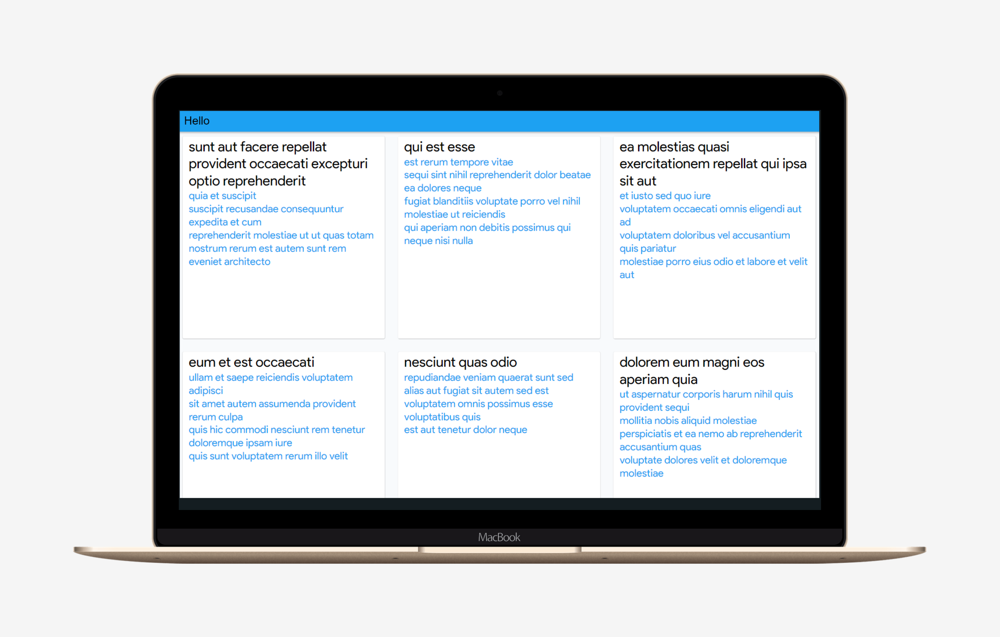
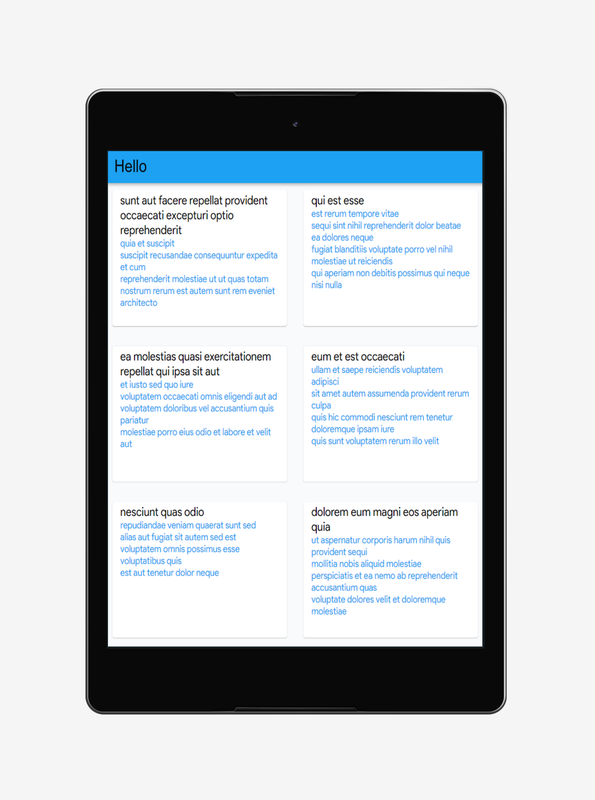
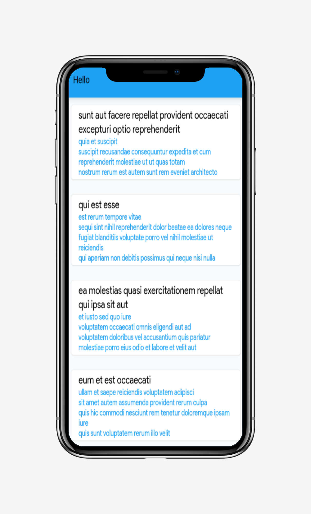

# Boilerplate Project

A boilerplate project created in flutter using Getx. Boilerplate supports both web and mobile

## Getting Started

The Boilerplate contains the minimal implementation required to create a new library or project. The repository code is preloaded with some basic components like basic app architecture, app theme, constants and required dependencies to create a new project. By using boiler plate code as standard initializer, we can have same patterns in all the projects that will inherit it. This will also help in reducing setup & development time by allowing you to use same code pattern and avoid re-writing from scratch.

---

### Folder Structure

Here is the core folder structure which flutter provides.

```
flutter-app/
|- android
|- build
|- ios
|- lib
|- test
```

Here is the folder structure we have been using in this project

```
lib/
|- constants/
|- data/
|- di/
|- ui/
|- utils/
|- main.dart
```

Now, lets dive into the lib folder which has the main code for the application.

```
1- constants - All the application level constants are defined in this directory with-in their respective files. This directory contains the constants for `theme`, `assets strings`, `text_theme`, `colors`, `strings`, etc.

2- data - Contains the data layer of your project, includes directories for local, network and shared pref/cache.

3- ui — Contains all the ui of your project, contains sub directory for each screen.

4- util — Contains the utilities/common functions of your application.

5- main.dart - This is the starting point of the application. All the application level configurations are defined in this file i.e, theme, routes, title, orientation etc.
```

---

### Constants

This directory contains all the application level constants. A separate file is created for each type as shown in example below:

```
constants/
|- app_theme.dart
|- app_text_theme.dart
|- assets.dart
|- colors.dart
|- dimensn.dart
|- font_family.dart
|- strings.dart
```

---

### Data

All the business logic of your application will go into this directory, it represents the data layer of your application. It is sub-divided into three directories `local`, `network` and `sharedperf`, each containing the domain specific logic. Since each layer exists independently, that makes it easier to unit test. The communication between UI and data layer is handled by using central repository.

```
data/
|- local/
    |- constants/
|- models/
|- network/
    |- apis/
    |- constants/
    |- exceptions/
    |- interceptor/
    |- repository/
    |- dio_client.dart
|- sharedpref
    |- constants/
    |- shared_preference_helper.dart
```

---

### DI

All the repositories, API and other dependencies will be initially injected from here.

```
di/
|- service_locator.dart
```

### UI

This directory contains all the ui of your application. Each screen is located in a separate folder making it easy to combine group of files related to that particular screen. All the screen specific widgets will be placed in `widgets` directory as shown in the example below:
Each screens have their own separate page, widgets, controller, and bindings.
The global widget directory is used to place widgets which is used globally throughout the app

```
ui/
|- global_widgets
|- home
   |- home_page.dart
   |- controller.dart
   |- bindings.dart
   |- widgets
      |- button_widget.dart
```

### Utils

Contains the common file(s) and utilities used in a project. The folder structure is as follows:

```
utils/
|- routes/
   |- routes.dart
   |- pages.dart
|- translation/
  |- en_US
  |- en_MX
  |- app_translations.dart
|- connection/
|- platform/
```

### Assets

Contains custom fonts, icons, and images
assets/
|- fonts/
|- icons/
|- images/

### Main

This is the starting point of the application. All the application level configurations are defined in this file i.e, theme, routes, title, orientation etc.

```dart
Future<void> main() async {
  WidgetsFlutterBinding.ensureInitialized();
  await setupLocator();

  service.SystemChrome.setPreferredOrientations(
      [service.DeviceOrientation.portraitUp]).then((_) {
    runApp(const MyApp());
  });
}

class MyApp extends StatelessWidget {
  const MyApp({Key? key}) : super(key: key);

  @override
  Widget build(BuildContext context) {
    return ScreenUtilInit(
      designSize: const Size(360, 690),
      builder: () => GetMaterialApp(
        debugShowCheckedModeBanner: false,
        locale: const Locale('en', 'US'),
        fallbackLocale: const Locale('en', 'US'),
        title: 'Getx Boilerplate',
        initialRoute: Routes.HOME,
        theme: appThemeData,
        defaultTransition: Transition.fade,
        getPages: AppPages.pages,
        translationsKeys: AppTranslation.translations,
      ),
    );
  }
}
```

## Responsiveness

The project is built with [flutter_screen_util], [responsive_builder] in order to make the application responsive.

### Desktop : <br>



### Tablet :<br>



### Mobile :


